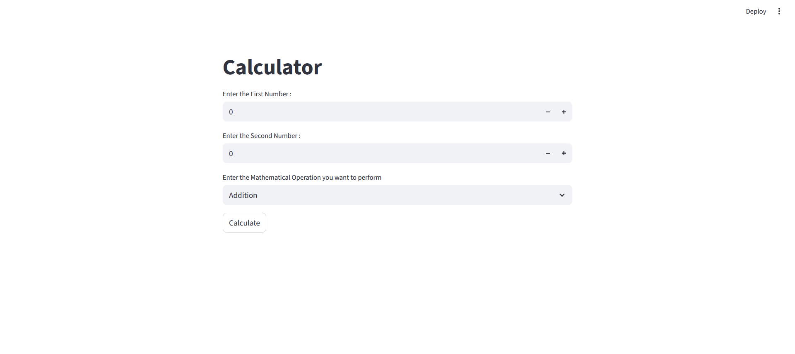

<h1 align="center">🧮 Simple Calculator</h1>

<p align="center">
  
</p>


<p align="center">
  A <strong>minimal and interactive calculator</strong> built using <a href="https://streamlit.io/">Streamlit</a>.<br>
  Perform basic arithmetic operations through a clean and user-friendly web interface.
</p>

---

## 📸 Screenshots

| Desktop View |
|--------------|
|  |

---

## 🚀 Features

✅ ➕ Addition  
✅ ➖ Subtraction  
✅ ✖️ Multiplication  
✅ ➗ Division  
✅ 🧩 Modulo Operation  

---

## 🛠️ Tech Stack

**Programming Language & Framework:**  


**Modules:**  
📦 Custom Python functions for modular arithmetic

---

## 📦 Installation & Setup

To run this project locally:

```bash
# Clone the repository
git clone https://github.com/kamalkori28/Calculator.git

# Navigate to the project directory
cd Calculator

# Install required packages
pip install -r requirements.txt

# Start the Streamlit app
streamlit run app.py
